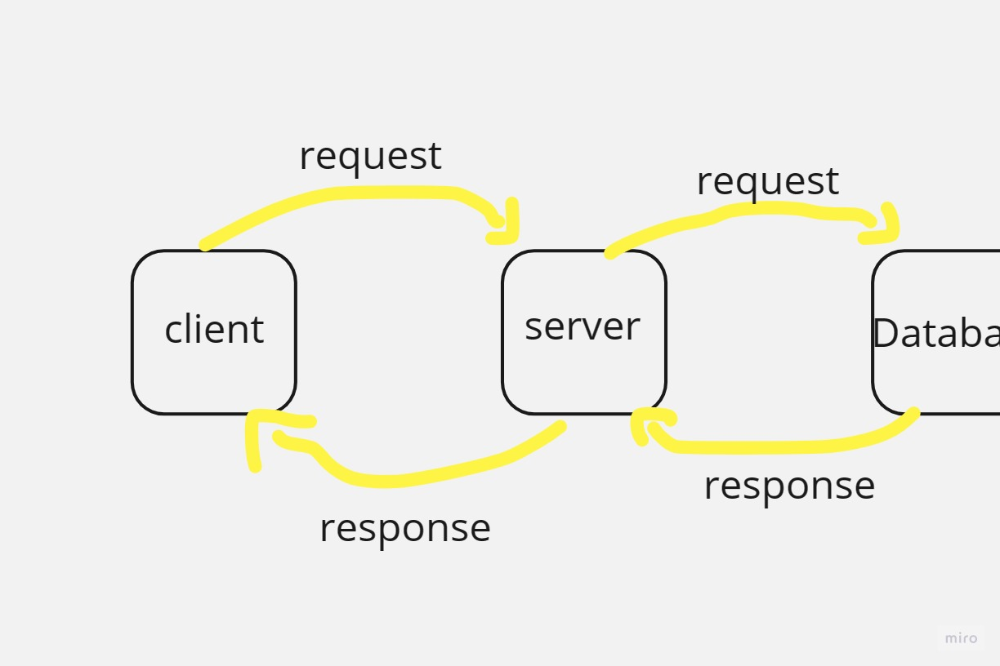

# Project Name - Movies LIBRARY
#  Project Version "1.0.0"

**Author Name**: Mohammad ALJadaan

## WRRC

## Overview
making a Movie library 
## Getting Started
* Create a repository on GitHub
* Clone the repository on your device
* Initialize it by running npm init -y command in the tirminal
* Create basic file structure
* Install the required packages by running  npm install command
* Create a route with a method of get and a path of for the trending
* express
* const server
* server.get
* server.listen
* Test your server
*connet the Database to the server
## Project Features
* show the trending, and search, and show upcoming, and show the top Rated movies
*connet the Database to the server and adding the user input to the database 
